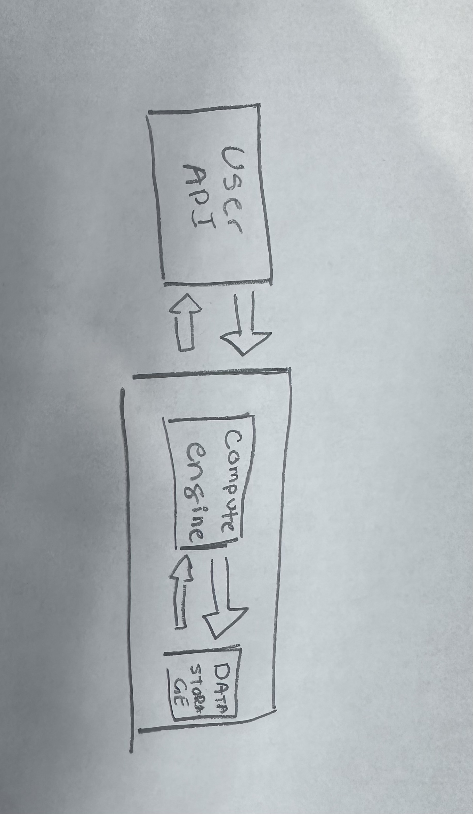

# CPS353 Project Spring 2025
## Sum of even numbers in fibonacci.

The computation in this repo will ask the user for a positive integer from a specified file. It will then show the fibonacci numbers up to the specificed integer.
It will then compute sum of all even numbers in the sequence.

